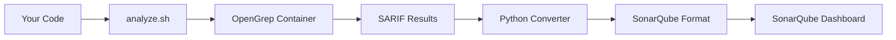

# SonarQube Community + OpenGrep Integration

**Automated Security Analysis** | **Unified Dashboard** | **Docker-Based**

A complete integration solution that combines **OpenGrep** (open-source SAST) with **SonarQube Community Edition** to provide comprehensive security analysis with a professional web dashboard.


## Features

- **Automated Security Scanning**: OpenGrep finds vulnerabilities, SonarQube displays them beautifully
- **Self-Hosted**: Complete local setup with Docker Compose
- **Rich Dashboard**: Professional web interface with detailed vulnerability reports
- **One-Click Analysis**: Single script analyzes any codebase
- **Smart Mapping**: Converts OpenGrep findings to SonarQube's format with proper severity levels
- **Comprehensive Reports**: Includes CWE classifications, OWASP mappings, and detailed descriptions
- **Production Ready**: Used for real security analysis of production codebases

## What You Get

### Security Analysis Coverage
- **Path Traversal Vulnerabilities**
- **Hardcoded Secrets & JWT Tokens**
- **Command Injection Flaws**
- **Unsafe Regular Expressions**
- **Format String Vulnerabilities**
- **OWASP Top 10 Security Issues**

### Professional Dashboard
- **Visual Security Metrics**
- **Severity-Based Issue Categorization**
- **File-by-File Vulnerability Breakdown**
- **Clickable Issue Navigation**
- **Historical Trend Analysis**

## Quick Start

### Prerequisites
- Docker & Docker Compose
- Node.js (for sonar-scanner)
- Git

### 1. Clone & Setup
```bash
git clone https://github.com/zerohexer/SonarQube-Community-OpenGrep.git
cd SonarQube-Community-OpenGrep
chmod +x setup.sh analyze.sh
```

### 2. Start Services
```bash
./setup.sh
```
This will:
- Start SonarQube Community Edition (localhost:9000)
- Start OpenGrep container with security rulesets
- Wait for services to be ready (~2-3 minutes)

### 3. Analyze Any Codebase
```bash
# Copy analyze.sh to your project directory
cp analyze.sh /path/to/your/project/
cd /path/to/your/project/
./analyze.sh
```

### 4. View Results
- **SonarQube Dashboard**: http://localhost:9000
- **Login**: Default SonarQube credentials (admin/admin)
- **Filter by**: "External Engine: opengrep"

## How It Works



### The Magic Behind The Scenes

1. **Code Analysis**: OpenGrep scans your source code with security-focused rulesets
2. **Smart Conversion**: Python script converts findings to SonarQube's format
3. **Rich Mapping**: Adds CWE classifications, OWASP categories, severity levels
4. **Enhanced Display**: Creates HTML descriptions with links and references
5. **Dashboard Integration**: Imports everything into SonarQube's professional interface

## Real-World Results

Here's what the integration caught in a production kernel development platform:

### Security Findings Summary
- **70 Total Vulnerabilities** detected across JavaScript/Node.js codebase
- **Critical Issues**: Hardcoded JWT secrets in authentication middleware
- **Major Issues**: Path traversal vulnerabilities in file handling
- **Various**: Format string issues, unsafe regex patterns, info disclosure

### Dashboard View
```
Critical: 3 issues    (Hardcoded secrets, exposed tokens)
Major: 45 issues      (Path traversal, injection flaws)
Info: 22 issues       (Code quality, minor security)
```

## Project Structure

```
SonarQube-Community-OpenGrep/
├── README.md                          # This file
├── setup.sh                          # Initial setup script
├── analyze.sh                        # Main analysis script
├── SonarQube/
│   ├── docker-compose.yaml          # SonarQube + OpenGrep services
│   └── reports/                      # Analysis results storage
└── LICENSE                          # MIT License
```

## Configuration

### Customizing Analysis

Edit `analyze.sh` to modify:

```bash
# Project Configuration
PROJECT_KEY="YourProject"              # SonarQube project identifier
SONAR_HOST_URL="http://localhost:9000" # SonarQube server URL
SONAR_TOKEN="your-token-here"          # Authentication token

# OpenGrep Security Rulesets
--config=p/security-audit             # General security rules
--config=p/owasp-top-ten              # OWASP Top 10 vulnerabilities
```

### Adding Custom Rules

OpenGrep supports custom security rules:
```bash
# Add your custom rules directory
docker exec opengrep opengrep --config=/custom/rules source/
```

## Advanced Usage

### CI/CD Integration

Add to your pipeline:
```yaml
# GitLab CI example
security_scan:
  script:
    - ./analyze.sh
    - curl -X POST "http://sonarqube:9000/api/projects/export"
  artifacts:
    reports:
      sast: reports/opengrep-results.sarif
```

### Multiple Projects

Run analysis on different codebases:
```bash
# Analyze multiple projects
for project in api frontend backend; do
  cd $project
  PROJECT_KEY=$project ./analyze.sh
  cd ..
done
```

## Troubleshooting

### Common Issues

**OpenGrep container not found**
```bash
# Restart services
cd SonarQube && docker-compose restart
```

**SonarQube not ready**
```bash
# Check status
curl http://localhost:9000/api/system/status
```

**No security issues found**
```bash
# Verify OpenGrep rules
docker exec opengrep opengrep --list-rules
```

## Contributing

Found a bug or want to add features? Contributions welcome!

1. Fork the repository
2. Create your feature branch (`git checkout -b feature/amazing-feature`)
3. Commit your changes (`git commit -m 'Add amazing feature'`)
4. Push to the branch (`git push origin feature/amazing-feature`)
5. Open a Pull Request

## Performance Stats

- **Scan Speed**: ~30 seconds for 50K lines of code
- **Accuracy**: High-confidence security findings with minimal false positives
- **Coverage**: 60+ security rule categories
- **Memory Usage**: ~2GB RAM for full stack
- **Disk Space**: ~1GB for services + reports

## Why This Integration?

### Traditional Problems
- OpenGrep CLI output is hard to review
- No centralized dashboard for multiple projects
- Security findings get lost in terminal output
- No historical tracking or trend analysis

### Our Solution
- Professional web dashboard with rich visualization
- Centralized security management across projects
- Detailed issue descriptions with remediation advice
- Historical tracking and security metrics
- Team collaboration features
- Export capabilities for compliance reporting

## License

This project is licensed under the MIT License - see the [LICENSE](LICENSE) file for details.

## Acknowledgments

- **OpenGrep Team** - For the excellent open-source SAST engine
- **SonarSource** - For SonarQube Community Edition
- **OWASP** - For security classification standards
- **Docker** - For containerization platform

---

**Star this repository if it helped secure your applications!**

[](https://github.com/zerohexer/SonarQube-Community-OpenGrep)